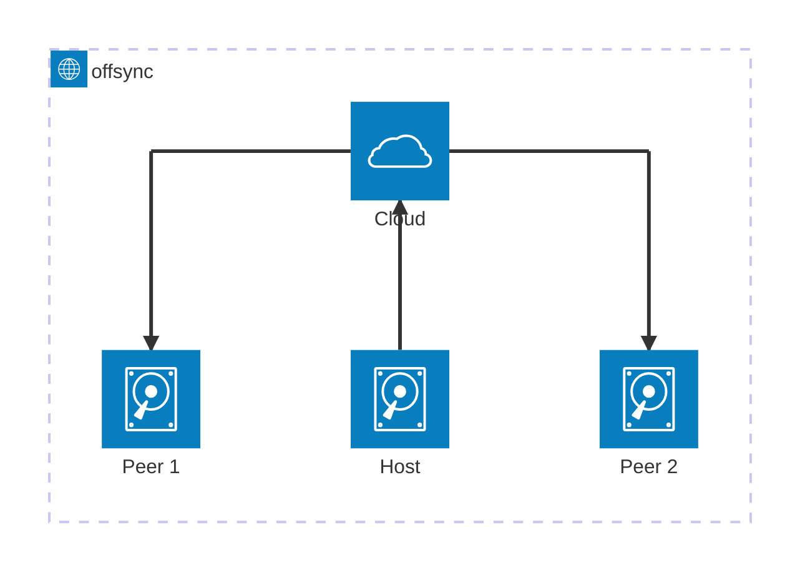

# Architecture Notes

TODO: Rewrite this in C4-PlantUML.

At first I would like to constriant the system so that
the changes can only be made on the host,
i.e. the other storage devices are READ-ONLY.

Later, all devices will be able to make changes.
Then there's no more distinguishing between a peer and a host,
and a suitable name should be given.

## Implementation
